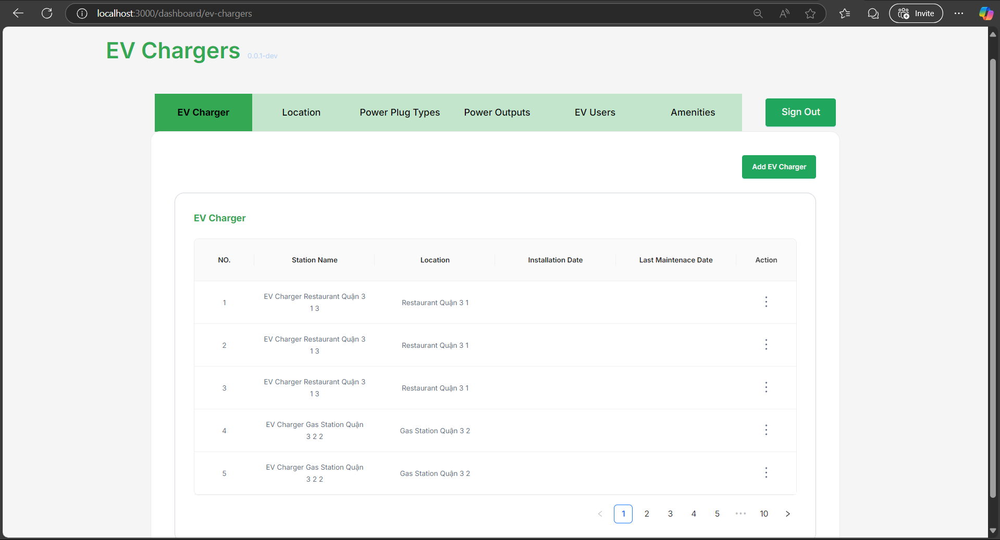
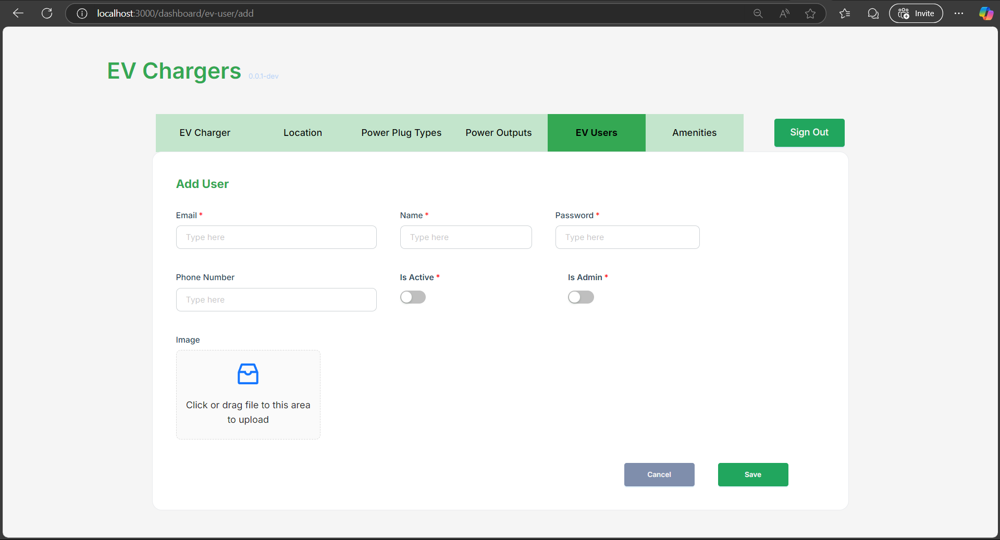
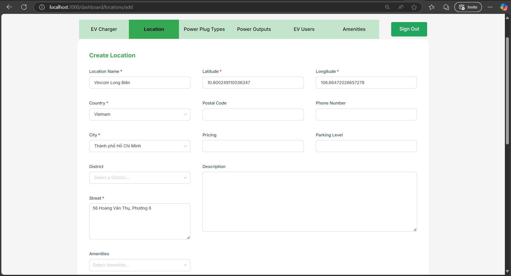
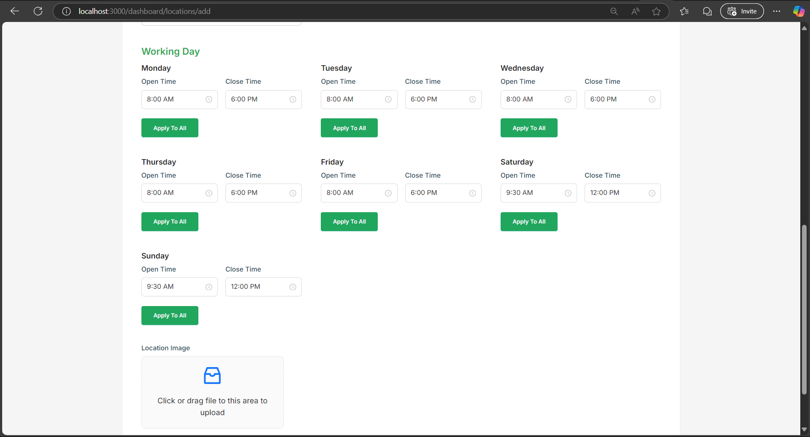
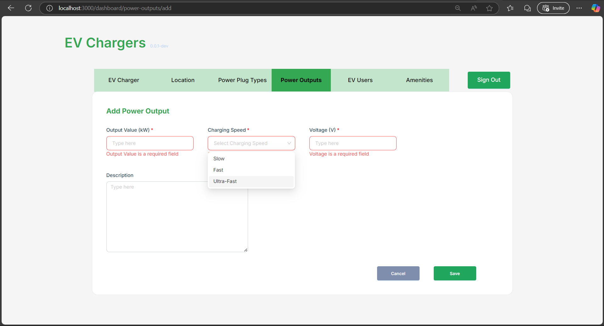
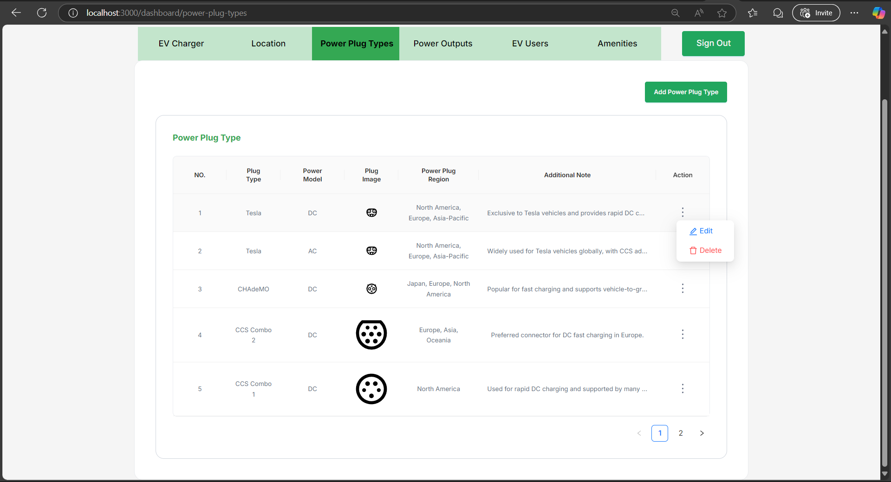

# ⚡ EV Charger Admin Portal

<div align="center">
  
  
  **A modern, responsive admin dashboard for managing EV charging stations**
  
  
  
  
  
</div>

## 🚀 Features

- 🎯 **User Management** - Comprehensive user and technician administration
- 🔌 **Charger Management** - Monitor and control EV charging stations
- 📊 **Analytics Dashboard** - Real-time insights and reporting
- 🏢 **Location Management** - Organize charging stations by location
- 🛠️ **Task Management** - Assign and track maintenance tasks
- 🔐 **Secure Authentication** - NextAuth.js integration
- 📱 **Responsive Design** - Mobile-friendly interface
- 🎨 **Modern UI** - Built with Ant Design components

## 📸 Screenshots

<div align="center">

### 🚗 EV Charger Management
*Monitor and manage all EV charging stations in one place*



---

### 👥 User Management
*Create and manage user accounts with comprehensive forms*



---

### 📍 Location Management
*Organize charging stations by location with detailed information*

<table>
<tr>
<td width="50%">

<p align="center"><em>Location Details Form</em></p>
</td>
<td width="50%">

<p align="center"><em>Location Configuration</em></p>
</td>
</tr>
</table>

---

### ⚡ Power Configuration
*Configure power outputs and plug types for optimal charging*

<table>
<tr>
<td width="50%">

<p align="center"><em>Power Output Settings</em></p>
</td>
<td width="50%">

<p align="center"><em>Plug Type Management</em></p>
</td>
</tr>
</table>

</div>

## 🛠️ Tech Stack

- **Framework**: [Next.js 14](https://nextjs.org/) with App Router
- **Language**: [TypeScript](https://www.typescriptlang.org/)
- **Styling**: [Ant Design](https://ant.design/) + [Styled Components](https://styled-components.com/)
- **State Management**: [Redux Toolkit](https://redux-toolkit.js.org/)
- **Data Fetching**: [React Query](https://tanstack.com/query/latest)
- **Authentication**: [NextAuth.js](https://next-auth.js.org/)
- **Form Handling**: [React Hook Form](https://react-hook-form.com/) + [Yup](https://github.com/jquense/yup)
- **HTTP Client**: [Axios](https://axios-http.com/)
- **Package Manager**: [npm](https://www.npmjs.com/) (comes with Node.js)

## 📋 Prerequisites

Before you begin, ensure you have the following installed:

- **Node.js** (v18.0.0 or higher) - [Download Node.js](https://nodejs.org/)
- **npm** (v8.0.0 or higher) - Comes with Node.js
- **Git** for version control

## 🚀 Quick Start

### 1. Clone the Repository

```bash
git clone https://github.com/ev-charger-project/admin-page.git
cd admin-page
```

### 2. Install Dependencies

```bash
npm install
```

### 3. Environment Setup

Create a `.env.local` file in the root directory and configure the following variables:

```env
# API Service URLs
NEXT_PUBLIC_EV_CHARGER_SERVICE_BASE_URL=http://localhost:8000
NEXT_PUBLIC_AUTH_SERVICE_BASE_URL=http://localhost:4000

# NextAuth Configuration
NEXTAUTH_SECRET=your-secret-key-here
NEXTAUTH_URL=http://localhost:3000

# Application Version
NEXT_PUBLIC_VERSION=0.0.4-dev
```

> **📝 Note**: Replace `your-secret-key-here` with a secure random string. You can generate one using:
> ```bash
> openssl rand -base64 32
> ```

### 4. Backend Services

Ensure the following backend services are running:

- **EV Charger Service**: `http://localhost:8000`
- **Auth Service**: `http://localhost:4000`

### 5. Start the Development Server

```bash
npm run dev
```

🎉 **Success!** Open [http://localhost:3000](http://localhost:3000) to view the admin portal.

## 🎯 Available Scripts

| Command | Description |
|---------|-------------|
| `npm run dev` | Start development server |
| `npm run dev-turbo` | Start development server with Turbo mode |
| `npm run build` | Build for production |
| `npm start` | Start production server |
| `npm run lint` | Run ESLint |
| `npm run lint:fix` | Fix ESLint issues |
| `npm run type-check` | Run TypeScript type checking |
| `npm run format:fix` | Format code with Prettier |

## 🏗️ Project Structure

```
admin-page/
├── 📁 public/           # Static assets
│   └── 📁 icons/        # SVG icons
├── 📁 src/
│   ├── 📁 api/          # API service functions
│   ├── 📁 app/          # Next.js App Router pages
│   ├── 📁 components/   # Reusable UI components
│   ├── 📁 config/       # Configuration files
│   ├── 📁 container/    # Page containers
│   ├── 📁 hooks/        # Custom React hooks
│   ├── 📁 interfaces/   # TypeScript interfaces
│   ├── 📁 store/        # Redux store
│   └── 📁 utils/        # Utility functions
├── 📄 .env.local        # Environment variables
├── 📄 next.config.mjs   # Next.js configuration
└── 📄 package.json      # Dependencies
```

## 🔧 Development Workflow

1. **Start Development**: `npm run dev`
2. **Code Changes**: Edit files in `src/` directory
3. **Hot Reload**: Changes are automatically reflected
4. **Type Check**: Run `npm run type-check` before committing
5. **Lint & Format**: Use `npm run lint:fix` and `npm run format:fix`

## 🌐 API Integration

The admin portal connects to two main services:

- **EV Charger Service**: Manages charging stations, users, and locations
- **Auth Service**: Handles authentication and authorization

All API configurations are in `src/api/` directory.

## 🎨 UI Components

Built with Ant Design for consistency and professional appearance:

- **Tables**: Data display with sorting and filtering
- **Forms**: Validation with React Hook Form + Yup
- **Modals**: Confirmation and detail dialogs
- **Navigation**: Sidebar and header components
- **Charts**: Data visualization components

## 📱 Responsive Design

The application is fully responsive and works on:
- 💻 Desktop (1024px+)
- 📱 Tablet (768px - 1023px)
- 📱 Mobile (320px - 767px)

## 🚀 Deployment

### Vercel (Recommended)

1. Connect your repository to [Vercel](https://vercel.com)
2. Configure environment variables in Vercel dashboard
3. Deploy automatically on push to main branch

### Docker

```bash
# Build image
docker build -t ev-charger-admin .

# Run container
docker run -p 3000:3000 ev-charger-admin
```

## 🔍 Learn More

- **Next.js**: [Documentation](https://nextjs.org/docs) | [Learn Next.js](https://nextjs.org/learn)
- **Ant Design**: [Components](https://ant.design/components/overview/) | [Design Language](https://ant.design/docs/spec/introduce)
- **React Query**: [Documentation](https://tanstack.com/query/latest/docs/react/overview)
- **Redux Toolkit**: [Documentation](https://redux-toolkit.js.org/introduction/getting-started)

## 🤝 Contributing

1. Fork the repository
2. Create a feature branch: `git checkout -b feature/amazing-feature`
3. Commit changes: `git commit -m 'Add amazing feature'`
4. Push to branch: `git push origin feature/amazing-feature`
5. Open a Pull Request

## 📄 License

This project is licensed under the MIT License.

## 👨‍💻 Support

For support and questions:
- 🐛 Issues: [GitHub Issues](https://github.com/ev-charger-project/admin-page/issues)

---

<div align="center">
  <p>Made with ❤️ by @denda0duong</p>
</div>
